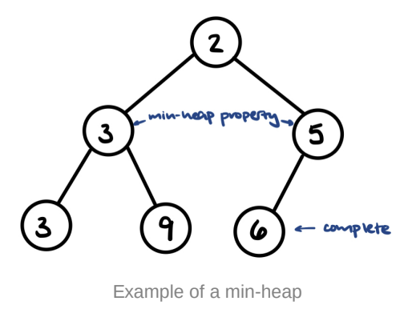
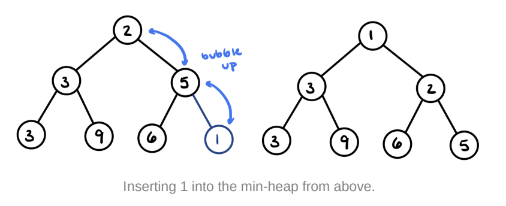
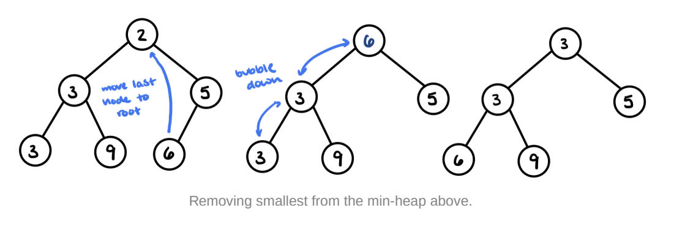
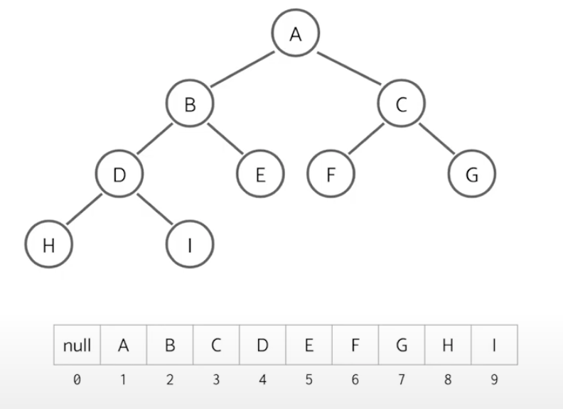
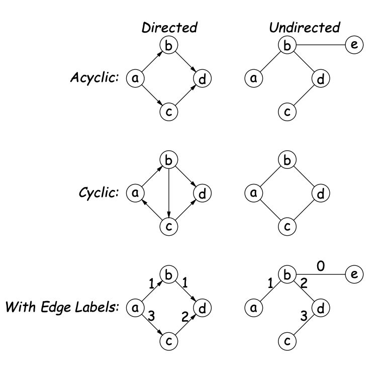
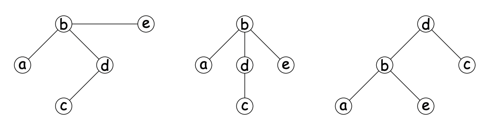
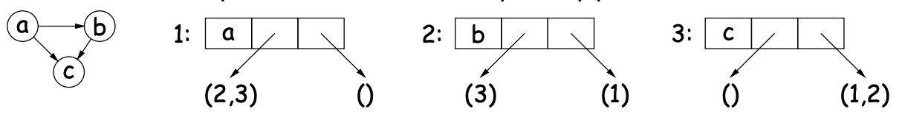
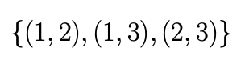
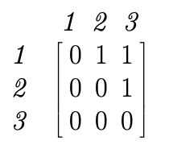

# CS 61B: Data Structures

    University of California, Berkeley
    Instructors: Paul Hilfinger
    hilfingr@cs.berkeley.edu
    Office Hours: TBD
    Lecture: Mon/Wed/Fri 1:00pm-2:00pm, Stanley 105 as capacity allows
    https://berkeley.zoom.us/j/94882182481?pwd=Q1BuVGdHb2p3T3JKc2xhMHRpZE9jQT09#success
    Author: Will Tholke

## Table of Contents

- [CS 61B: Data Structures](#cs-61b-data-structures)
  - [Table of Contents](#table-of-contents)
  - [Lecture 1, 08/25/21 (Wk1): Intro, Hello World Java](#lecture-1-082521-wk1-intro-hello-world-java)
    - [Grading](#grading)
    - [Methods (Functions)](#methods-functions)
    - [Selection & Access](#selection--access)
  - [Lecture 2, 08/27/21 (Wk1): A Little Programming](#lecture-2-082721-wk1-a-little-programming)
    - [Writing Programs](#writing-programs)
    - [Example: printPrimes](#example-printprimes)
  - [Lecture 3, 08/30/21 (Wk2): Values and Containers](#lecture-3-083021-wk2-values-and-containers)
    - [Values and Containers](#values-and-containers)
    - [Primitive Operations](#primitive-operations)
    - [Destructive vs. Non-destructive](#destructive-vs-non-destructive)
  - [Lecture 4, 09/01/21 (Wk2): Simple Pointer Manipulation](#lecture-4-090121-wk2-simple-pointer-manipulation)
    - [The "Final" Keyword](#the-final-keyword)
    - [Examples of Destructive Incrementing](#examples-of-destructive-incrementing)
  - [Lecture 5, 09/03/21 (Wk2): Arrays](#lecture-5-090321-wk2-arrays)
    - [Arrays](#arrays)
    - [Insert Into an Array](#insert-into-an-array)
    - [Java Shortcut](#java-shortcut)
    - [Multidimensional Arrays](#multidimensional-arrays)
  - [Lecture 6, 09/08/21 (Wk3): Developing a Sort, Unit Testing](#lecture-6-090821-wk3-developing-a-sort-unit-testing)
    - [Multidimensional Arrays (continued)](#multidimensional-arrays-continued)
    - [How do We Know If it works?](#how-do-we-know-if-it-works)
    - [Testing Workflow (Test Driven Development)](#testing-workflow-test-driven-development)
    - [JUnit: Explained](#junit-explained)
  - [Lecture 7, 09/10/21 (Wk3): Object-Based Programming](#lecture-7-091021-wk3-object-based-programming)
    - [What is object-based programming?](#what-is-object-based-programming)
    - [The Pieces](#the-pieces)
    - [Getter Methods](#getter-methods)
    - [Class Variables, Methods, & static](#class-variables-methods--static)
    - [Instance Methods](#instance-methods)
    - [Constructors](#constructors)
  - [Lecture 8, 09/13/21 (Wk4): Object-oriented Mechanisms](#lecture-8-091321-wk4-object-oriented-mechanisms)
    - [Dynamic vs. Static types](#dynamic-vs-static-types)
    - [Type Hierarchies](#type-hierarchies)
    - [The Basic Static Type Rule](#the-basic-static-type-rule)
    - [Overriding and Extension](#overriding-and-extension)
    - [Extending a Class](#extending-a-class)
  - [Lecture 9, 09/15/21 (Wk4): Interfaces and Abstract Classes](#lecture-9-091521-wk4-interfaces-and-abstract-classes)
    - [Abstract Methods and Classes](#abstract-methods-and-classes)
    - [Overriding Methods](#overriding-methods)
    - [Interfaces](#interfaces)
  - [Lecture 10, 09/17/21 (Wk4): Interfaces and Abstract Classes](#lecture-10-091721-wk4-interfaces-and-abstract-classes)
    - [Specification Seen by Clients](#specification-seen-by-clients)
    - [Abstract Classes](#abstract-classes)
    - [Parent Constructors](#parent-constructors)
    - [Overriding](#overriding)
  - [Lecture 11, 09/20/21 (Wk5): Examples: Comparable and Reader](#lecture-11-092021-wk5-examples-comparable-and-reader)
    - [Comparable](#comparable)
    - [Reader (relevant for HW 3)](#reader-relevant-for-hw-3)
  - [Lecture 12, 09/22/21 (Wk5): Additional OOP Details, Exceptions](#lecture-12-092221-wk5-additional-oop-details-exceptions)
    - [Package](#package)
  - [Lecture 13, 09/24/21 (Wk5): Packages, Access, Loose Ends](#lecture-13-092421-wk5-packages-access-loose-ends)
    - [Package Mechanics](#package-mechanics)
    - [Access Modifiers](#access-modifiers)
    - [The Access Rules: Private & Protected](#the-access-rules-private--protected)
    - [Intentions of this Design](#intentions-of-this-design)
  - [Lecture 14, 09/27/21 (Wk6): Integers](#lecture-14-092721-wk6-integers)
    - [Types & Bits](#types--bits)
    - [Overflow](#overflow)
    - [Modular Arithmetic](#modular-arithmetic)
    - [Modular Arithmetic: Examples](#modular-arithmetic-examples)
    - [Negative Numbers](#negative-numbers)
  - [Lecture 15, 09/29/21 (Wk6): Integers](#lecture-15-092921-wk6-integers)
    - [Bit Manipulation](#bit-manipulation)
  - [Lecture 16, 10/01/21 (Wk6): Complexity](#lecture-16-100121-wk6-complexity)
    - [Runtime](#runtime)
  - [Lecture 17, 10/04/21 (Wk7): Collections, Amortization](#lecture-17-100421-wk7-collections-amortization)
    - [Data Types in the Abstract](#data-types-in-the-abstract)
  - [Lecture 18, 10/06/21 (Wk7): Sequences, Some Design](#lecture-18-100621-wk7-sequences-some-design)
    - [Views, Maps, & More](#views-maps--more)
  - [Lecture 19, 10/08/21 (Wk7): Sequences (II)](#lecture-19-100821-wk7-sequences-ii)
    - [More Assorted Topics](#more-assorted-topics)
  - [Lecture 20, 10/11/21 (Wk8): Trees](#lecture-20-101121-wk8-trees)
    - [What are Trees?](#what-are-trees)
    - [CS61B Style Trees](#cs61b-style-trees)
    - [Tree Characteristics (I)](#tree-characteristics-i)
    - [Tree Traversal](#tree-traversal)
  - [Lecture 21, 10/13/21 (Wk8): Tree searching](#lecture-21-101321-wk8-tree-searching)
    - [Binary Search Tree (BST) Definitions](#binary-search-tree-bst-definitions)
    - [Binary Search Trees Explained](#binary-search-trees-explained)
    - [BST Operations: Search, Insert, & Delete](#bst-operations-search-insert--delete)
      - [Searching & Inserting](#searching--inserting)
    - [Deleting](#deleting)
    - [Runtime](#runtime-1)
  - [Lecture 22, 10/15/21 (Wk8): Hashing](#lecture-22-101521-wk8-hashing)
    - [Integer Overflow & Hashcode Definition](#integer-overflow--hashcode-definition)
    - [Hash Tables](#hash-tables)
    - [Save Memory Using Separate Chaining](#save-memory-using-separate-chaining)
    - [Summary: Hash Tables](#summary-hash-tables)
  - [Lecture 23, 10/18/21 (Wk9): Game Trees](#lecture-23-101821-wk9-game-trees)
    - [Recommended Video](#recommended-video)
  - [Lecture 24, 10/20/21 (Wk9): Priority Queues, Range Queries](#lecture-24-102021-wk9-priority-queues-range-queries)
    - [Resources](#resources)
    - [Binary min-heaps](#binary-min-heaps)
    - [Heap Operations Overview](#heap-operations-overview)
    - [Heap Operations: Insertion](#heap-operations-insertion)
    - [Heap Operation: Remove Smallest](#heap-operation-remove-smallest)
    - [Runtime](#runtime-2)
    - [Min/Max Priority Queues](#minmax-priority-queues)
    - [Heap Representation as Arrays](#heap-representation-as-arrays)
  - [Lecture 25, 10/22/21 (Wk9): Generics](#lecture-25-102221-wk9-generics)
    - [Generics](#generics)
  - [Lecture 26, 10/25/21 (Wk10): Sorting](#lecture-26-102521-wk10-sorting)
    - [Sorting](#sorting)
  - [Lecture 27, 10/27/21 (Wk10): Sorting (II)](#lecture-27-102721-wk10-sorting-ii)
    - [Sorting (II)](#sorting-ii)
  - [Lecture 28, 10/29/21 (Wk10): Sorting (III)](#lecture-28-102921-wk10-sorting-iii)
    - [Sorting (III)](#sorting-iii)
  - [Lecture 29, 11/01/21 (Wk11): Balanced Search Structures](#lecture-29-110121-wk11-balanced-search-structures)
    - [Balanced Search](#balanced-search)
  - [Lecture 30, 11/03/21 (Wk11): Review (and it's my birthday!)](#lecture-30-110321-wk11-review-and-its-my-birthday)
    - [Review](#review)
  - [Lecture 31, 11/05/21 (Wk11): Balanced Search Structures (II)](#lecture-31-110521-wk11-balanced-search-structures-ii)
    - [Balanced Search (II)](#balanced-search-ii)
  - [Lecture 32, 11/08/21 (Wk12): Git Internals](#lecture-32-110821-wk12-git-internals)
    - [Overview of Git](#overview-of-git)
    - [History of Git](#history-of-git)
    - [Major User-Level Features](#major-user-level-features)
    - [Conceptual Structure](#conceptual-structure)
    - [Major User-Level Features (part 2)](#major-user-level-features-part-2)
    - [Internals](#internals)
    - [Content-Addressable File System](#content-addressable-file-system)
    - [Broken Idea for Implementing the CAF System](#broken-idea-for-implementing-the-caf-system)
    - [SHA1](#sha1)
    - [Low-Level Blob Management](#low-level-blob-management)
  - [Lecture 33, 11/10/21 (Wk12): Graphs, Introduction, Traversals](#lecture-33-111021-wk12-graphs-introduction-traversals)
    - [Why Graphs?](#why-graphs)
    - [Terminology](#terminology)
    - [Trees are Graphs](#trees-are-graphs)
    - [Representation](#representation)
    - [Traversing a Graph](#traversing-a-graph)
    - [Examples](#examples)
  - [Lecture 34, 11/12/21 (Wk12): A* Search, Minimal spanning trees, Union-find](#lecture-34-111221-wk12-a-search-minimal-spanning-trees-union-find)
    - [A* Search](#a-search)
    - [Minimum Spanning Trees](#minimum-spanning-trees)
    - [Kruskal’s Algorithm](#kruskals-algorithm)
  - [Lecture 35, 11/15/21 (Wk13): Pseudo-Random Sequences](#lecture-35-111521-wk13-pseudo-random-sequences)
    - [Why Random Sequences?](#why-random-sequences)
  - [Lecture 36, 11/17/21 (Wk13): Dynamic Programming, Enumeration Types](#lecture-36-111721-wk13-dynamic-programming-enumeration-types)
    - [Subtitle #1](#subtitle-1)
  - [Lecture 37, 11/19/21 (Wk13): Threads, Garbage Collection](#lecture-37-111921-wk13-threads-garbage-collection)
    - [Subtitle #1](#subtitle-1-1)
  - [Lecture 38, 11/22/21 (Wk14): Continued from Friday](#lecture-38-112221-wk14-continued-from-friday)
    - [Subtitle #1](#subtitle-1-2)
  - [Lecture 39, 11/30/21 (Wk15): Compression](#lecture-39-113021-wk15-compression)
    - [Subtitle #1](#subtitle-1-3)
  - [Lecture 40, 12/01/21 (Wk15): TBD](#lecture-40-120121-wk15-tbd)
    - [Subtitle #1](#subtitle-1-4)

## Lecture 1, 08/25/21 (Wk1): Intro, Hello World Java

### Grading
  
- **Homework/Labs:** ~10%	– 20
- **Projects:** ~50% – 100
- **Tests:** ~17% – 34
- **Final Exam:** ~23% – 46
- **Total:** ~100% – 200

### Methods (Functions)

- Function headers in Java specify the *types* of values *returned* by the function and taken as *parameters* to the functions
- `void` has no posisble values and returns nothing
- `String` is like Python's `str`
- `[]` means *array of*; an array is like a Python list but with a fixed size

### Selection & Access

- `Class.method`: `System.out.println` means "the method `println` that applies to the pbject references by the value of variable `System.out`
- **Public (exported) classes, methods, and variables** may be referred to anywhere else in the program; access permissions don't actually make the language more powerful, they just indicate whether something should be accessed or not
- **Static methods** and **static variables** are defined in the global frame

## Lecture 2, 08/27/21 (Wk1): A Little Programming

### Writing Programs

To write programs, one should either start with the highest level of abstraction and work downwards into its components **or** lay out its componenets and build into abstraction.

**The Main Method**

The main method of a java program is defined under `public static void main(String[] args)`.

*Writing methods inside the main method* is nearly impossible as nested functions are not supported in Java. *Tracing back through programs* is also considered to be bad practice, as Hilfinger pointed out in today's lecture. Alternatively, we should look through one iteration of a method and then refer to that method's comment, which is quite useful when looking at recursive methods.

### Example: printPrimes

**Task:** write a program that prints prime numbers up to and including a limit

**Definition:** a prime number is an integer greater than 1 that has no divisors smaller than itself other than 1: 2, 3, 5, 7, 11, etc.

```java
private static void printPrimes(int limit) {
  int np;  // notice that semicolons follow standalone lines
  np = 0;
  for (int p = 2; p <= limit; p += 1) {  // p initialized; p <= limit is the condition; p += 1 for each iteration
    if (isPrime(p)) {
      System.out.print(p + " ");  // print on same line
      n += 1;  // implementation of iteration
      if (np % 10 == 0)
        System.out.println();
    }
  }
  if (np % 10 != 0)  // if more than 10 prime numbers
    System.out.println();  // print newline
}
```

The `printPrimes` defined in lecture (not included here) is a **tail recursive method** given that, for a final result to be computed, frames opened for each recursive call are not dependent on the frame prior; that is, each frame that opens as a result of a recursive call *closes* either when a subsequent recursive call is made or if the method returns in that call.

We don't use recursion here because recursive calls are **expensive**. We should use iteration instead!

## Lecture 3, 08/30/21 (Wk2): Values and Containers

### Values and Containers

- **Values**: numbers, booleans, and pointers; values cannot change
  - Ex: `3`, `'a'`, `true`
- **Pointers**: point to containers; null points to nothing
- **Containers**:
  - **Simple Containers**: contain values; the contents of containers can change; are all named
  - **Structured Container**: contains (0 or more) other containers; are all anonymous; pointers point only to structured containers
    - Ex: Class object, Array Object, Empty Object
    - Structured containers contain only simple containers

### Primitive Operations

```java
public class IntList {
  // Constructor function (used to initialize new object)
  /** List cell containing (HEAD, TAIL). */
  public IntList(int head, IntList tail) {
    this.head = head; this.tail = tail;
}
```

- `IntList Q, L;` initialize empty list with names Q, L

- `L = new IntList(3, null);` L points to new list [3, null]
- `Q = L;` Q points to L; **it's the same object!** (very important)

- `Q = new IntList(42, null);` Q is now [42, null]
- `L.tail = Q;` the end of L is now Q, and L is [3, 42, null]

- `L.tail.head += 1;` the value of the head of the end of L, 42, is now 43
- Now `Q.head == 43` and `L.tail.head == 43`

### Destructive vs. Non-destructive

**Side note:** Instance variables should always be private!

A method is `non-destructive` when it leaves the input objects unchanged, whereas a `destructive` method may modify the input objects so that the original data is no longer available.

**Example: Non-destructive IncrList**

```java
/** List of all items in P incremented by n. */
static IntList incrList(IntList P, int n) {
  if (P == null)
    return null;
  else return new IntList(P.head+n, incrList(P.tail, n));
}
```

**Example: Destructive IncrList**
```java
static IntList incrList(IntList P, int n) {
  if (P == null)  // if the list is empty
    return null;
  IntList result, last;
  result = last = new IntList(p.head+n, null);
  while (P.tail != null) {
    P = P.tail;
  }
}
```

## Lecture 4, 09/01/21 (Wk2): Simple Pointer Manipulation

### The "Final" Keyword

In Java, the keyword **final** in a variable declaration means that the variable’s value may not be changed after the variable is initialized.

### Examples of Destructive Incrementing

Check out the [lecture slides from today](https://inst.eecs.berkeley.edu/~cs61b/fa21/materials/lectures/lect4.pdf)

## Lecture 5, 09/03/21 (Wk2): Arrays

### Arrays
  
An array is a structured container whose components are

- length, a fixed iteger
- a sequence of length simple containers of the same type, numbered from 0
- (.length field usually implicit in diagrams)

Arrays are **anonymous**, like other structured containers, and are always **referred to with pointers**

As an example, for an array pointed to by `A`,

- Length is `A.length`
- Numberered component `i` is `A[i]` (i is the index)
- Important feature: index can be any integer expression

```java
// Array Syntax
int[] q;
q = new int[] { 1, 2, 3 };

// Short form for delcarations
int[] r = { 7, 8, 9 };
```

### Insert Into an Array

The logic:

- start from the last element of an array `arr`, `arr.length - 1`
- move the last element to the right 1 and the element before it into the last element's place
  - stop doing this once you've hit the index in the list where you want to insert a value
- `arr[k] = 'new element that you want to insert'`

### Java Shortcut

Can write just `arraycopy` by including at the top of the
source file:

`import static java.lang.System.arraycopy;`

### Multidimensional Arrays

Multidimensional arrays are not primitive in Java, but we can build them with arrays of arrays!

```java
int[][] A = new int[3][];
A[0] = new int[] {2, 3, 4, 5};
A[1] = new int[] {4, 9, 16, 25};
A[2] = new int[] {8, 27, 64, 125};
```

## Lecture 6, 09/08/21 (Wk3): Developing a Sort, Unit Testing

### Multidimensional Arrays (continued)

- Since every element of an array is independent, there is no single "width" in general
  - Multidimensional arrays can take on any M x N format (think matricies in EECS 16A!)

### How do We Know If it works?

- **Unit testing** - testing of individual units (methods) within a program, rather than the whole program
- **Module testing** - testing of classes or other groupings of methods and data
- **System testing (acceptance testing)** - testing of the functionality of an entire program
- **Integration testing** - intermediate between unit and system testing, tests that modules work correctly together
- **Regression testing** - testing with the specific goal of the cheking that fixes, enhances, or makes other changes that have not introduced faults (regressions)

### Testing Workflow (Test Driven Development)

**Test Driven Development:** write your tests *before* you write the methods

- In a unit test, give a bunch of arrays to sort and then make sure they each get sorted properly
- **Check for edge cases:**
  - empty array, one-element, all elements the same
- **Check for "middle" cases:**
  - Elements reversed, elements in order, one pair of elements reversed
- Then, write the method: test the method: refactor if necessary

### JUnit: Explained

- Provides some handy tools for unit testing
- `@Test` is java annotation (which provides information about a method, clsas, etc., that can be examined within Java itself) that tells the JUnit machinery to call a method
- In the testing method, you'll have a collection of methods with names beginning with `assert` then allow your test cases to check conditions and report failures

The main method will run all of the test cases in a given class:
```java
public static void main (String... args) {
  ucb.junit.textui.runClasses(SortTesting.class);
}
```

## Lecture 7, 09/10/21 (Wk3): Object-Based Programming

### What is object-based programming?

- **Object-based programs** are organized around the *types of objects* that are used to represent data; methods are grouped by the type of object. 
- On the other hand, **function-based programs** are organized primarily around the functions (methods, etc.) that do things. Data structures (objects) are considered separate.

### The Pieces

- **Class declaration** defines a new type of object, i.e. new type of structured container
- **Instance variables** are the simple containers within these objects (fields or components)
- **Instance methods**, such as `deposit` and `withdraw` are like ordinary (static) methods that take an invisible extra parameter (called **this**)
- The new operator creates (*instantiates*) new objects, and initializes them using constructors
- **Constructors** such as the method-like declaration of `Account` are special methods that are used *only* to intialize new methods

### Getter Methods

**Getter methods** proctect attributes from being set from outside of the class. 

**Note:** we should put a private underscore in front of private instance variables

```java
public class Account {
  private int _balance;
  ...
  public int balance() { 
    return _balance; 
    }
  ...
}
```

### Class Variables, Methods, & static

Class variables are not associated with any particular Account, but is common to all–it is class-wide. 
- In Java, **"class-wide" = static**

### Instance Methods

```java
int deposit(int amount) {
  _balance += amount;
  _funds += amount;
  return balance;
}
```

### Constructors

All classes have constructors (they always get called); if you don't provide a constructor, then one is provided for you, called the default constructor

```java
public class Foo {
  pubnlic Foo() {}
}
```

**Note:** multiple *overloaded* constructors are possible, and they can use each other (although the syntax is odd)

## Lecture 8, 09/13/21 (Wk4): Object-oriented Mechanisms

### Dynamic vs. Static types

- Every value has a type≠its **dynamic type**
- Every container (variable, component, parameter), literal, function call, and operation expression (e.g. x+y) has a type–its **static type**
- Therefore, every **expression has a static type**.

### Type Hierarchies

- All types are subtypes of themselves (& that's for all primitive types)
- Null's type is a subtype of all reference types
- Reference types form a **type hierarchy**: some are subtypes of othersw
- All reference types are subtypes of `Object`

### The Basic Static Type Rule

- Java is designed such that any expression of (static) type T always yields a value that "is a" T
- Static types are "known to the compiler," because you declare them
  - Ex: `String x;`

### Overriding and Extension

Casting is *clumsy*. 

**Q:** If I know `Object` variable `x` contains a `String`, why can't I write `x.startsWith("this")`?

**Answer:** `startsWith` is only defined on Strings, not on all `Objects`, so the compiler isn't sure it makes sense (unless you cast)

### Extending a Class

To say that class B is a direct subtype of class A, write

```java
class B extends A { ... }
```

By default, `class ... extends java.lang.Object`

The subtype *inherits* all fields and methods of its direct superclass (and passes them along to any subtypes)

In class B, you may override an instance method (not a static method), by providing a new definition with the same *signature* (name, return type, argument types)

## Lecture 9, 09/15/21 (Wk4): Interfaces and Abstract Classes

### Abstract Methods and Classes

- Instance methods can be **abstract**: No body given; must be supplied in subtypes; can't make a `new` abstract objec
- Regular classes can extend abstract ones to make them "less abstract" by overriding their abstract methods

### Overriding Methods

- Comments are often unhelpful on overriding methods since the comments are usually definined in the class from which the subclasses are derived
- `@Override` notation is needed to indicate that a given method overrides something

### Interfaces

- An *interface*, in programming, is a *description* of generic interaction, specificially, a description of the functions or variables by which two things interact
- Java uses the term to refer to a slight variant of an abstract class that (until Java 1.7) contains only abstract methods (and static constants)

## Lecture 10, 09/17/21 (Wk4): Interfaces and Abstract Classes

### Specification Seen by Clients
  
- The clients of a module (class, program, etc.) are the programs or methods that *use* that module's exported definitions
- In Java, intention is that exported definitions are designated **public**
- Clients are intended to rely on *specifications* (aka APIs), not code
- **Syntactic specification:** method and constructor headers–syntax needed to use
- **Semantic specification:** what they do. No formal notation, so use comments
  - Semantic specification is a *contract*
  - Conditions client must satisfy (*preconditions*)
  - Promised results (*postconditions*)
  - Design these to be *all the client needs*!
  - Exceptions communicate errors, specifically failure to meet pre-conditions

### Abstract Classes

"An *abstract class* is one that is declared `abstract`... it may or may not include abstract methods" - *The Java™ Tutorials*

### Parent Constructors

- There is a call to a parent constructor at the beginning of every one of the child's constructors

### Overriding

**Overriding** - if a "subclass" has a method with the exact same signature as in the "superclass," we say the subclass overrides the emthod.
- Any method in a list that overrides something from an interface needs the `@Override` decorator
- 

## Lecture 11, 09/20/21 (Wk5): Examples: Comparable and Reader

### Comparable

- Java library provides an interface to describe Objects that have a *natural order* on them, such as `String`, `Integer`, `BigInteger`, and `BigDecimal`

```java
public interface Comparable<T> {
  int compareTo(T x);
}
```

### Reader (relevant for HW 3)

- Java class `java.io.reader` abstracts *sources of characters*

## Lecture 12, 09/22/21 (Wk5): Additional OOP Details, Exceptions

### Package
  
No notes taken

## Lecture 13, 09/24/21 (Wk5): Packages, Access, Loose Ends

### Package Mechanics
  
- Quite simply, packages are collections of "related" classes and other packages
- Java puts standard libraries and packages in package `java` and `javax`
- By default, a class resides in the `anonymous package`

### Access Modifiers

- Access modifiers (private, public, protected) **do not add anything to the power of Java**
- They do, however, basically allow a programmer to declare which classes are supposed access what declarations
- It also serves as security that prevent programmers from accessing things that would "break" the runtime system

### The Access Rules: Private & Protected

- Private members are only available within the text of the same class, even for subtypes
- Package Private members are available only within the same package (even for subtypes)
- Protected members have all the same attributes as Package Private, but you can access the protected member inside syntypes

### Intentions of this Design
- `public` declarations represent `specifications`–what clients of a package are supposed to rely on
- `package private` declarations are part of the `implementation` of a class that must be known to other classes that assist in the implementation
- `protected` declarations are part of the implementation that subtypes may need, but that clients of the subtypes generally won't
- `private` declarations are part of the implementation of a class that only that class needs

## Lecture 14, 09/27/21 (Wk6): Integers

### Types & Bits

- Byte/short -> 8/16 bits -> (byte) 3
- Char -> 16 bits -> '\n'
- Int -> 32 bits -> 123
- Long -> 64 bits -> 123L

### Overflow

**Problem:** how do we handle overflow, such as occurs in `10000*10000*10000`?

- Java defines the result of any arithmetic operation or conversion on integer types to "wrap around"–modular arithmetic
  - When it comes to modular arithmetic, think about the Enigma cipher; what happens when we're at the end of the permutation list? We wrap back around to the beginning! 

### Modular Arithmetic

```
a'' = a'
a' + b'' = (a' + b') = a + b'
(a' - b')' = (a' + (-b)')' = (a - b)'
(a^k)' = ((a')^k)' = (a * (a^(k-1))')', for k > 0
```

### Modular Arithmetic: Examples

- (byte) (64 * 8) yields 0, since 512 - 0 = 2 * 2^8
- (char) (-1) yields 2^16 - 1, since -1 - (2^16 - 1) = -1 * 2^16

### Negative Numbers

- Java's definition is the natural one for a machine that uses binary arithmetic

## Lecture 15, 09/29/21 (Wk6): Integers

### Bit Manipulation
  
No notes taken. Please refer to Hilfinger's [lecture slides for lecture 15](https://inst.eecs.berkeley.edu/~cs61b/fa21/materials/lectures/lect14.pdf). Note that the slides say "Lecture 14."

## Lecture 16, 10/01/21 (Wk6): Complexity

### Runtime
  
No notes taken. Please refer to Hilfinger's [lecture slides for lecture 16](https://inst.eecs.berkeley.edu/~cs61b/fa21/materials/lectures/lect16.pdf).

## Lecture 17, 10/04/21 (Wk7): Collections, Amortization

### Data Types in the Abstract

No notes taken. Please refer to Hilfinger's [lecture slides for lecture 17](https://inst.eecs.berkeley.edu/~cs61b/fa21/materials/lectures/lect17.pdf).

## Lecture 18, 10/06/21 (Wk7): Sequences, Some Design 

### Views, Maps, & More
  
No notes taken. Please refer to Hilfinger's [lecture slides for lecture 18](https://inst.eecs.berkeley.edu/~cs61b/fa21/materials/lectures/lect18.pdf).

## Lecture 19, 10/08/21 (Wk7): Sequences (II)

### More Assorted Topics
  
No notes taken. Please refer to Hilfinger's [lecture slides for lecture 19](https://inst.eecs.berkeley.edu/~cs61b/fa21/materials/lectures/lect18.pdf).

## Lecture 20, 10/11/21 (Wk8): Trees

### What are Trees?
  
Trees have a recursive structure! They naturally represent recursively defined, hierarchical objects with more than one recursive subpart for each instance

**Common examples:** expresisons, sentences

Trees also describe search structures in which we recursively divide a set into multiple disjoint subsets

### CS61B Style Trees

- A tree is a set of **nodes** or (**vertices**), each of which has a **label** and one or more **child nodes**, such that no node descends (directly or indirectly) from itself. A node is the **parent** of its children
- A tree is either empty or consists of a node containing a label value and an indexed sequence of zero or more children, each a positional tree
- If every node has two positions, we have a **binary tree** and the children are its **left and right sub-trees**

**Remember,** nodes are the parents of their non-empty children

### Tree Characteristics (I)

- The **root** of a tree is a non-empty node with no parent! Every node is the root of a sub(tree)
- The **order, arity, or degree** of a node (tree) is its number (maximum number) of children
- **Leaf** refers to a node that doesn't have any non-empty children
- **Height** of a node in a tree is the largest distance to a leaf. A leaf has a *height of 0* and a non-empty tree's height is one more than the maximum height of its children.
- The **depth** of a node in a tree is the distance to the root of that tree. That is, in a tree whose root is *R*, *R* itself has depth 0 in *R*. 

### Tree Traversal

As nodes are *(enumerated**, we say that they are *visited*

Three basic orders for unumeration (+ some variations):
- **Preorder:** visit node, traverse its children.
- **Postorder:** traverse children, visit node.
- **Inorder:** traverse first child, visit node, traverse second child
(binary trees only).

## Lecture 21, 10/13/21 (Wk8): Tree searching

### Binary Search Tree (BST) Definitions

**A tree consists of:**
- A set of nodes
- A set of edges that connect those nodes
  - *Howver, there is one constraint*; there is exactly one path between any two nodes
  
In a rooted tree, we call one node the **root**:
- Every node `N` except the root has exactly one parent, defined as the first node on the path from N to the root
- The root is at the top of the tree (not like a real tree)
- A node with no child is called a leaf

One of the most important things to remember for BST's is that, *in a rooted binary tree, every node has either 0, 1, or 2 children (subtrees)*.

### Binary Search Trees Explained

- A binary search tree is a rooted binary tree with the BST property
- **BST Property:** for every node `X` in the tree,
  - every key in the *left subtree* is *less* than `X`'s key
  - every key in the *right subtree* is *greater* than `X`'s key

```py
# Example of a valid BST
          "dog"
          /   \
         /     \
      "bag"   "flat"
      /   \    /   \
     /    |    |    \
  "alf" "cat" "elf" "glut"
  ```

### BST Operations: Search, Insert, & Delete

#### Searching & Inserting

- if searchKey < T.key, search T.left
- if searchKey > T.key, search T.right

```java
static BST find(BST T, Key sk) {
  if (T == null) { // if the list is empty
    return null;
  }
  if (sk.equals(T.key)) { // if the search key == the key of T
    return T;
  } else if (sk < T.key) {
    return find(T.left, sk); // find the result on the left
  } else {
    return find(T.right, sk); // find the result on the right
  }
}
```

**What's the runtime to create a search on a "bushy" (looks like a normal tree but upside down) BST in the worst case?** Theta(log N). Bushy BSTs are extremely fast?

The insert method follows the same logic, ecept that we now insert whenever BST `T` is null! The delete method is a bit more difficult.

### Deleting

There are three cases when you're deleting nodes:
- **Case 1:** Deletion key has no children
  - In this case, just delete the node by removing its parent pointer
- **Case 2:** Deletion key has one child
  - Make the parent node of the deleted node point to the child node of the deleted node
- **Case 3:** Deletion key has two children (the Hibbard deletion)
  - If a node has two children, something is going to need to replace that node
  - Must be > than everything in the left subtree
  - Must be < than everything in the right subtree
    - Choose either predecessor or successor (they can never have two children)
  - Josh Hug has a great explanation of this [here](https://www.youtube.com/watch?v=vPzB6svl4rc) @ 2:30 in the video

### Runtime

**Find:** Theta(H); to find a key, we may have to compare our key with all nodes along the longest path from foot to leaf
**Insert:** Theta(H); we may have to compare our inserted key with all nodes along the longest path from root to leaf, eventually inserting the node underneath that leaf
**Delete:** Theta(H); we find a predecessor or successor, set the deleted node to it, delete the prececessor or successor; takes theta(H) in the worst case but Theta(1) for every time we swap with the root and delete the predecessor or successor


## Lecture 22, 10/15/21 (Wk8): Hashing

### Integer Overflow & Hashcode Definition

In Java, the biggest posisble integer is 2,147,483,647. If you go over this limit, you overflow, starting back at the smallest integer `-2,147,483,648`

**Hashcode** projects a value from a set with many (or even an infinite number of) members to a value from a set with a fixed number of (fewer) members

Collisions are inevitble due to integer overflow

### Hash Tables

Supposed that `N` items have the same numerical representation `h`:
- Instead of storing `true` in a position `h`, we store a "bucket" of these `N` items at position `h`
- The bucket can be any sort of collection in which you itearate over and look for things

The performance of one of these hash tables has, instead of constant time operations, `theta(Q)` operations where `Q` is the length of the longest link

### Save Memory Using Separate Chaining

If we use the 10 buckets on  he right, where should our five items go?
- Well, we'd want to put them in the bucket equal to `hashCode % sizeOfArrayListofBuckets`
- E.g. `hashCode % 10` for an array list of buckets of length 10
- This is effectively the same as wrapping the hashcode so it's always within the length of the list
- The upside in this method is that we only need the last digit to wrap, but the downside is that we'll have much longer collections (can be lists) in each bucket

### Summary: Hash Tables

- Data is converted by a **hash function** into an integer represeitation called a **hash code**
- The **hash code** is then **reduced** to a valid *index*, usually using the modulus operator, e.g. `2348762878 % 10 = 8`
  
The process goes like this:
```
data -> hash function -> hash code -> reduce (often with %) -> index
```
- **BEWARE** that we can't use `%` to handle negative hash codes

- *If we had a had table with 5 buckets, what's the order of growth of Q with respect to N?* It's theta(N)

## Lecture 23, 10/18/21 (Wk9): Game Trees

### Recommended Video

[This](https://www.youtube.com/watch?v=l-hh51ncgDI) video was recommended by my CSM mentor. It contains all of the relevant logic behind game trees. Shout out to Kyle Zhang!

## Lecture 24, 10/20/21 (Wk9): Priority Queues, Range Queries

### Resources 

- [CSM Worksheet: More Trees and Heaps](https://csm-web-resource-aggregation.s3.amazonaws.com/resources/CS61B/Week_9_More_Trees_and_Heaps.pdf)
- [CSM Worksheet: Walthrough Playlist](https://www.youtube.com/watch?v=L_ub_oCLOEE&list=PLN303KpCz_KQIeiVYyi4q-byvCV5FcySh&index=1)
- [Associated Josh Hug Lecture Playlist](https://www.youtube.com/playlist?list=PL8FaHk7qbOD50LnOXTSpYgnVJQTIVFsmI)

### Binary min-heaps

- **Binary min-heap** - binary tree that is *complete* and obeys *min-heap property*
  - *Min-heap*: every node is less than or equal to both of its children
  - *Complete*: missing items only at the bottom level (if any), all nodes are as far left as possible; every node must have two children unless it's at the bottom level
    - Intuitively, if a binary tree is *incomplete*, not all of its nodes are as far left as possible AND/OR a node that's not at the bottom level does not have two children
- There's also something called *max-heap property*, which is when every node is greater than or equal to both of its children

**How could we design `getSmallest()`? In other words, what's the smallest node value in a binary min-heap?** It will always be the root of the heap.



### Heap Operations Overview

- `getSmallest()` - return the item in the root node
- `add(x)` - place the new node in the last position, and promote as high as possible
- `removeSmallest()` - assassinate the root note, promote the rightmost person in the heap to president. Then, demote repeatedly, always taking the 'better' successor

### Heap Operations: Insertion

- **Add the node to the end of the heap** temporarily
- **Reheapify** by bubbling (or "swimming") up the node until it is in the correct location



### Heap Operation: Remove Smallest

- **Move the last node** (bottommost and rightmost) **into the root**
- **Reheapify** by bubbling (or "sinking") down the node, swapping with the *smallest* child node until it is in the correct location.



### Runtime

Heaps maintain a **complete** tree, meaning that the runtime is theta(log N) where `N` is the number of items in the heap

**Insertion:** in the worst case, we must bubble up until reaching the root, meaning that there will be a runtime of theta(log N)

**Remove Smallest:** in the rowst case, we move the last node to the root, and must bubble down to the lowest level, hence the runtime theta(log N)

**Get Smallest:** we return the root node, taking constant time theta(1)

### Min/Max Priority Queues

The **priority queue** is an abstract data type that expands beyond normal first-in-first-out (FIFO) and last-in-first-out (LIFO) functionality
- In a *max priority queue*, elements with larger priority values will have higher priority
- In a *min priority queue*, elements with smaller priority values will have higher priorityw

### Heap Representation as Arrays

**Binary trees can be represetned as arrays that have the following properties:**
- The root of the tree will be in position one of the array, meaning that the value of the array at the 0th index will be `null` (this is usually done in the constructor)
- In the following examples, by position, we mean *index*
- The *left child* of a node at position `i` is at position `2i`
- The *right child* of a node at position `i` is at positions `2i + 1`
- The parent of a node at positions `i` is at positions `i/2` rounding down

Use the above rules to confirm the the expmple below is correct.

**Example:**



## Lecture 25, 10/22/21 (Wk9): Generics

### Generics

No notes taken. Please refer to Hilfinger's [lecture slides for lecture 25](https://inst.eecs.berkeley.edu/~cs61b/fa21/materials/lectures/lect25.pdf). 

## Lecture 26, 10/25/21 (Wk10): Sorting

### Sorting
  
No notes taken. Please refer to Hilfinger's [lecture slides for lecture 26](https://inst.eecs.berkeley.edu/~cs61b/fa21/materials/lectures/lect26.pdf). 

## Lecture 27, 10/27/21 (Wk10): Sorting (II)

### Sorting (II)
  
No notes taken. Please refer to Hilfinger's [lecture slides for lecture 27](https://inst.eecs.berkeley.edu/~cs61b/fa21/materials/lectures/lect27.pdf).

## Lecture 28, 10/29/21 (Wk10): Sorting (III)

### Sorting (III)
  
No notes taken. Please refer to Hilfinger's [lecture slides for lecture 28](https://inst.eecs.berkeley.edu/~cs61b/fa21/materials/lectures/lect28.pdf).

## Lecture 29, 11/01/21 (Wk11): Balanced Search Structures

### Balanced Search
  
No notes taken. Please refer to Hilfinger's [lecture slides for lecture 29](https://inst.eecs.berkeley.edu/~cs61b/fa21/materials/lectures/lect29.pdf).

## Lecture 30, 11/03/21 (Wk11): Review (and it's my birthday!)

### Review

Good luck on the midterm!

## Lecture 31, 11/05/21 (Wk11): Balanced Search Structures (II)

### Balanced Search (II)
  
No notes taken. Please refer to Hilfinger's [lecture slides for lecture 30](https://inst.eecs.berkeley.edu/~cs61b/fa21/materials/lectures/lect31.pdf).

## Lecture 32, 11/08/21 (Wk12): Git Internals

### Overview of Git
  
- **Git** is a distributed version-control system, the most popular one currently being used
- Git stores snapshots (**versions**) of the files and directory structure of a project, keeping track of their relationships, authors, dates, and **log messages**
- It is **distributed** in that there can be many copies of a given repository, each supporting independent development, with machinery to transmit and reconcile versions between repositories
- Its operation is extremely fast

### History of Git

- Developed by Linus Torvalds (and others in the Linux community) after Bitkeeper withdrew the free version
- Took about 2-3 months to create, in time for the 1.6.12 Linux kernel release in June, 2005
- Git is British-English slang, meaning "unpleasant person"

### Major User-Level Features

- Abstraction is of a graph of versions or snapshots (called **commits*)
- The graph structure reflects ancestry: which versions came from which
- Each commit contains
  - A directory tree of files (like a Unix directory)
  - Information about who committed and when
  - Log message
  - Pointers to commit (or commits, if there was a merge) from which the commit was derived

### Conceptual Structure

- Main internal components consist of four types of **objects**:
  - **Blobs**: hold contents of files
  - **Trees**: directory structures of files
  - **Commits**: contain references ot trees and additional info (comitter, date, log message, etc.)
  - **Tags**: references to commits or other objects, with additional information, intended to identify releases, other important versions, etc.

### Major User-Level Features (part 2)

- Each commit has a unique name
- Transmitting a commit from repository A to repository B requires only the transmission of those objects (files or directory trees) that B does not yet have
  - Hence the reason for the message `Everything up-to-date.`
  - "Which objects don't you have" problem is caused by the difficulty in only transferring objects that are missing in the target repository
- Repositories maintain *named* **branches**, identifiers of particular commits that are updated to keep track of the most recent commits in various lines of development
- **Tags** are just named pointers to particular commits. Usually not changed, which is different than branches

### Internals

- Each Git repository is contained in a directory
  - Can either be a bare directory (just a collections of objects and metadata) or included as part of a working directory
- To save space, data in files is compressed
- Git can garbage-collect the objects from time to time to save additional space

### Content-Addressable File System

- Could use some way of naming objects that is universal
  - *We use the names, then, as pointers*
- Solves the "Which objects don't you have?" problem mentioned 
- The only invariant thing about some object is *its contents*, but we can't use the contents as the name

### Broken Idea for Implementing the CAF System

- **Idea:** Use a hash of the contents as the address
- **Problem:** That doesn't work
- **Brilliant Idea:** Use it anyway

**Cryptographic Hash Functions** are designed to withstand cryptoanalytic attacks, and should have
  - *Pre-image resistance*: given `h = f(m)`, should be computationally infeasible to find such a message `m`
  - *Second pre-image resistance*: given message `m1`, should be infeasible to find `m2 != m1` such that `f(m1) = f(m2)`
  - *Collision resistance*: should be difficult to find *any* two messages `m1 != m2` such that `f(m1) = f(m2)`

With the above properties, the idea of using the hash of commit contents as a name is extremely unlikely to fail, *even when the system is used maliciously*

### SHA1

- Git uses **SHA1** (Secure Hash Function 1)
  - **SHA1** is a cryptographic hash function
  - Developed by the NSA and published by NSIT
- Can play around with this using the `hashlib` module in Python3
- All object names in Git are 160-bit hash codes of contents, in hex
- A recent commit in the shared CS61B repository could be fetched (if needed) with
  - `git checkout 3b30599cc43f4616eb626f8fa4fb2d0610d97963`
  - Notice that the above is the 160-bit hash code of contents!

### Low-Level Blob Management

Find the hashcode that Git uses for the "blob" containing file `something.java` with
- `git hash-object something.java`

If the above tells you that the file would have hash code
- `192a0ca0d159f1550b0b5e102f7e06867cc44782`

and you actually `git add` this file, its compresed contents will be stored in the file
- `.git/objects/19/2a0ca0d159f1550b0b5e102f7e06867cc44782`

and you can look at them (uncompressed) with
- `git cat-file -p 192a0ca0d159f1550b0b5e102f7e06867cc44782`

## Lecture 33, 11/10/21 (Wk12): Graphs, Introduction, Traversals

### Why Graphs?
  
Express non-hierarchically related items
- **Networks:** pipelines, roads, assignment problems
- **Representing processes:** flow charts, Markov models
- **Representing partial orderings:** PERT charts, makefiles

### Terminology

- A **graph** consists of
  - A set of **nodes** (aka **vertices**)
  - A set of **edges**: pairs of nodes
  - Nodes with an edge between them are *adjacent*
  - Depending on the problem, nodes or edges may have **labels** (aka **weights**)
- Typically call node set `V = {v_0, ...}`, and edge set `E`.
- If the edges have an order (first, second), they are *directed edges*, and we have a *directed graph (digraph)*, otherwise an *undirected graph*
- Edges are *incident* to their nodes
- Directed edges *exit* one node and *enter* the next
- A **cycle** is a path without repeated edges leading from a node back to itself
- A graph is *cyclic* if it has a cycle, else *acyclic*
  - **Directed Acyclic Graph (DAG)**

**Examples:**



### Trees are Graphs

- A graph is *connected* if there is a (possibly directed) path between every pair of nodes
  - If one node of the pair is *reachable* from the other

A **free tree** is a connected, acyclic, undirected graph (i.e. we're free to pick the root)



### Representation

- *Edge list representation*: each node contains some kind of list (e.g. linked list or array) of its successors (and possibly predecessors)



- *Edge sets*: collection of all edges. For the graph above:
  


- *Adjacency matrix*: represent connection with matrix entry



### Traversing a Graph

- We can't quite use recursion because of the cycles (in acyclic graphs, we can get combinatoral explosions)
- Treat 0 as the root and ddo recursive traversal down the two edges out of each node: `theta(2^N)` operations

### Examples

Examples of *recursive depth-first traversal*, *topological sorting*, *depth-first search*, the *general graph traversal algorithm*, and *Dijkstra's algorithm* can be found towards the end of the slides for [Fall 2019, Lecture 33](https://inst.eecs.berkeley.edu/~cs61b/fa19/materials/lectures/lect33.pdf).


## Lecture 34, 11/12/21 (Wk12): A* Search, Minimal spanning trees, Union-find

### A* Search

To be updated

### Minimum Spanning Trees

To be updated

### Kruskal’s Algorithm

To be updated

## Lecture 35, 11/15/21 (Wk13): Pseudo-Random Sequences

### Why Random Sequences?

A **random sequence** is an unpredictable sequence where all numbers occur with equal frequency. "Truly" random sequences must have some nondeterministic external source

A **pseudo-random sequence** is a deterministic sequence that passes some given set of statistical tests that random sequences (probably) pass

**We might use random sequences to:**

1) Choose statistical samples
2) Run simulations
3) Construct random algorithms
4) Construct games
5) Help in cryptography
   - Choosing random keys and **nonces**, random one-time values used to make messages unique
   - Generating streams of random bits

To be updated

## Lecture 36, 11/17/21 (Wk13): Dynamic Programming, Enumeration Types

### Subtitle #1

-

## Lecture 37, 11/19/21 (Wk13): Threads, Garbage Collection

### Subtitle #1
  
-

## Lecture 38, 11/22/21 (Wk14): Continued from Friday

### Subtitle #1
  
-

## Lecture 39, 11/30/21 (Wk15): Compression

### Subtitle #1
  

## Lecture 40, 12/01/21 (Wk15): TBD

### Subtitle #1
  
-